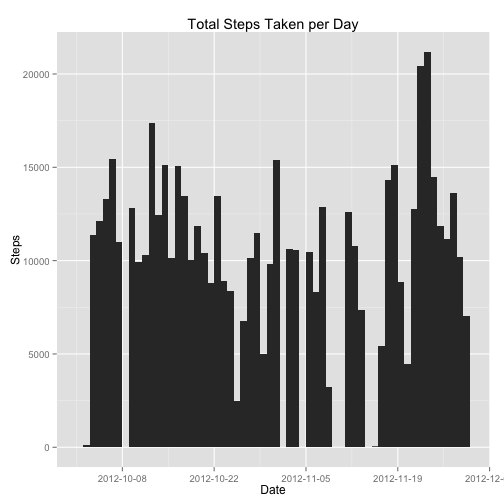
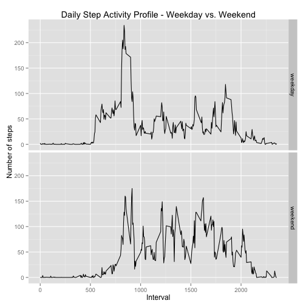

## Loading and preprocessing the data

The data for the report is kept in the activity.zip file. We can extract the data
CSV file from the zip archive and load it into memory. We also convert the date field
from a factor value to a Date object to make manipulation by date easier in the remainder
of the report.


```r
unzip("./activity.zip")
activitydata <- read.csv("./activity.csv")
activitydata$date <- as.Date(activitydata$date)
```


## What is mean total number of steps taken per day?

First, let's start by computing the total number of steps by day in the data frame.


```r
dailysteps <- aggregate(steps ~ date, data=activitydata, sum)
```

We can then plot a quick histogram of this daily step totals to explore what the data
set looks like.

```r
library(ggplot2)
```

```
## Find out what's changed in ggplot2 with
## news(Version == "1.0.0", package = "ggplot2")
```

```r
ggplot(dailysteps, aes(x=date)) +
  geom_histogram(aes(weight=steps), binwidth=1) +
  scale_x_date(breaks="2 weeks") +
  ggtitle("Total Steps Taken per Day") +
  ylab("Steps") + 
  xlab("Date")
```

 

We would expect that the mean number of steps based on the histogram would be around 10,000. We
can calculate the actual mean and median steps from the data.


```r
meansteps <- as.integer(mean(dailysteps$steps))
mediansteps <- median(dailysteps$steps)
```

We can see that the actual mean number of steps is 10766 with a median value of
10765. This is close to what we noticed with the histogram data.


## What is the average daily activity pattern?

To determine what the daily pattern for the data is, we need to compute a new
data set with a unique list of the 5-minute intervals and use the mean function to
group steps into a step count within that interval.


```r
intervalmeans <- aggregate(steps ~ interval, data=activitydata, mean)
```

We can now explore the data set using a line chart.


```r
plot(intervalmeans$interval, intervalmeans$steps, type = "l")
```

 

The interesting feature of this plot is the fairly large spike around the 750th 5-minute
interval. We can determine the exact point using the following R code.


```r
intervalmeans[intervalmeans$steps==max(intervalmeans$steps),]
```

```
##     interval    steps
## 104      835 206.1698
```


## Imputing missing values


```r
nasteps <- sum(is.na(activitydata$steps))
steps <- nrow(activitydata)
nasteppcent <- round((nasteps / steps) * 100)
```

The presence of NA values can throw off the calculations. In this particular data set
there are 2304 missing step records out of 17568 total step records. That is
13% of records are missing.

To fix this problem, all NA step values will be replaced with the mean step value for
that interval - basically replcing the missing steps with what an average daily step
value would be for the missing interval.


```r
fill_in_steps <- function(row) {
  if(is.na(row[1])) {
    return(intervalmeans[intervalmeans$interval==row[2],]$steps)
  }
  else {
    return(row[1])
  }
}

imputeddata <- data.frame(activitydata)
imputeddata$steps <- apply(imputeddata[,c("steps", "interval")], 1, fill_in_steps)
```

With this new data set, we can generate a histogram and calculate the mean as we did
in the first part of this report.


```r
imputeddailysteps <- aggregate(steps ~ date, data=activitydata, sum)
```

We can then plot a quick histogram of this daily step totals to explore what the data
set looks like.

```r
library(ggplot2)
ggplot(imputeddailysteps, aes(x=date)) +
  geom_histogram(aes(weight=steps), binwidth=1) +
  scale_x_date(breaks="2 weeks") +
  ggtitle("Total Steps Taken per Day with NA Values Imputed") +
  ylab("Steps") + 
  xlab("Date")
```

 

And calculate the mean and median values.

```r
mean(imputeddailysteps$steps)
```

```
## [1] 10766.19
```

```r
median(imputeddailysteps$steps)
```

```
## [1] 10765
```

As far as we can tell, the NA values did not cause us a problem in our analysis. Part of
this lies in the fact that the aggregate function used removed NA values from the analysis.
The simple technique that we used for imputing the value has the same effect on the
analysis as removing the value entirely.


## Are there differences in activity patterns between weekdays and weekends?

To start, we need to add a classification variable to the activity data frame.


```r
typeofday <- factor(c("weekday", "weekend"))

compute_type_of_day <- function(d) {
  day <- weekdays(d)
  if(day == "Saturday" || day == "Sunday") {
    return(typeofday[2])
  }
  else {
    return(typeofday[1])
  }
}

activitybyday <- data.frame(activitydata)
activitybyday$daytype <- lapply(activitybyday$date, compute_type_of_day)
```

With the classified data, we can build a time series chart of weekday vs. weekend data
points. Let's start by computing a list of interval values for weekday and weekend types,
using the mean function to aggregate similar values.


```r
weekdayintervals <- aggregate(steps ~ interval, 
                              data=activitybyday[activitybyday$daytype == 1,],
                              mean)

weekdayintervals$type <- typeofday[1]


weekendintervals <- aggregate(steps ~ interval,
                              data=activitybyday[activitybyday$daytype == 2,],
                              mean)

weekendintervals$type <- typeofday[2]
```

With both of these interval observations separated, we can plot out a time series
chart for each.


```r
ggplot(rbind(weekdayintervals, weekendintervals), aes(x=interval)) +
  geom_line(aes(y=steps)) +
  facet_grid(type ~ .) +
  ggtitle("Daily Step Activity Profile - Weekday vs. Weekend") +
  ylab("Number of steps") +
  xlab("Interval")
```

 


